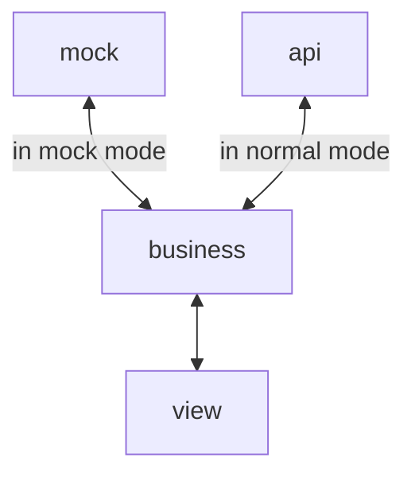

# vue-fusion

web端应用与移动端混合应用通用开发框架，主要技术栈为vue、vite和typeScript。

**_本仓库仅作示例使用，目的是展示在人力资源有限、前后端对接问题频发的情况下个人对前端框架设计的思考。_**

**_部分资源被移除，部分实现被简化，部分依赖未打包而是直接展示代码。_**

## 设计理念

### 优化目标

以提升开发效率、应用可靠性和代码可维护性为核心目标，兼顾性能、安全性、可访问性和用户体验。

### 设计原则

- 力求以最小的成本谋取最大的收益。
- 不过度追求非必要功能。

### 开发效率

- 核心是复用和自动化。
- 自建业务组件库、业务模板库和通用样式库。
  - 采用多重封装的方法，在提升易用性的同时保持灵活性。
  - 大幅度降低组件开发成本，创建组件市场。
  - 组件向配置化、命令式的方向发展，减少template、style部分的内容。
- 代码标准化。
  - 方便重用。
  - 方便AI模仿。
  - 降低错误率，降低测试成本。

### 可靠性

- 纯前端逻辑正确。
  - 把握数据流，把握数据流向，把握每个节点的输入输出类型，把握每个节点在成功和失败两种情况下的处理方案。
  - 进行足够的测试。主体上利用mock形成测试数据，再由人工手动进行测试或编写e2e测试用例进行自动测试。细节上辅以单元测试。
- 提高对异常数据的容错能力。
  - 要求任何数据问题都不能导致前端页面整体或局部崩溃。
  - 统一隔离后端数据。
  - 用户的输入需校验后才能使用。
  - 前端自己产生的数据应被完全掌控。
- 提高样式在不同屏幕、不同内容下的自适应能力。
  - 可靠的页面适配方案。
  - 内容驱动设计，而不是照抄设计稿。

### 可维护性

- 快速定位修改点。
  - 职责明确的分层结构。
  - 按领域组织的目录结构。
  - 扁平化的目录结构。
  - 通过注释分割线自定义文件结构，并通过编辑器插件进行展示。
  - 保持template部分内容简洁，快速定位逻辑入口。
- 缩小修改的影响范围。
  - 通过封装限制状态的作用范围，防止未知的第三方观测状态变化或修改状态，使代码更符合直觉。
  - 通过组合（纯）函数来抽象作用于数据之上的控制流，限制对外部状态的影响。
  - css方面，通过vue scoped机制限制选择器作用范围，通过BEM命名法避免选择器权重混乱问题，通过ITCSS方案保证全局样式不会覆盖具体样式。
- 减小功能扩展的难度。
  - 函数内的功能分支依次考虑提前return、抽离子函数和使用策略模式进行扩展。
  - 组件内以hook形式注入功能，hook之间使用getter和setter进行通信。
  - 文件级别利用`import 'xxx'`与`import 'xxx/index'`等效的特性变文件为目录进行扩展。
  - 微前端架构下利用import方法调用远程函数或结合异步渲染机制挂载远程组件。
- 防劣化机制。
  - linter约束。
  - formatter统一格式化。
  - code review。

### 性能

- 两个目标。
  - 快速加载页面。
  - 快速响应用户输入。
- 三个核心指标。
  - 页面最大内容渲染时间。
  - 页面渲染时元素累计偏移量。
  - 用户输入到下一次页面变化的时间。
- 两个瓶颈。
  - CPU瓶颈。JS任务长时间占用主线程，阻碍渲染任务的执行。
    - 分割长任务。
    - 避免长期连续生成微任务。
    - 使用worker另起线程。
  - IO瓶颈。均可抽象为资源加载问题。
    - 减少资源体积。压缩、tree shaking、使用新格式等。
    - 优化加载方案。预加载、按需加载、错峰加载、并发加载等。
    - 提高缓存命中率。
- 使用过渡效果弱化用户对时间的感知。

## 项目结构

```
src/
  business/
    example/
      api.ts -- api层
      index.ts -- business层
      mock.ts -- mock层
      model.ts -- model层
  share/
    routes.ts
    ...
  view/ -- view层
    example/ -- 子页面不嵌套
      Example.vue
      business.ts -- 业务逻辑
      nonBusiness.ts -- 非业务逻辑
      example.png -- 静态资源
      components/
        child/
          Child.vue
          GrandChild.vue -- 子组件不嵌套
          ...
      ...
  App.vue
  main.ts
```

完整项目分层为model、mock、api、business和view。其中model定义业务模型，mock定义mock函数，api定义接口函数，business定义业务函数，view实现页面逻辑。

目录结构按领域进行组织，同一业务模块的代码合并到一处，便于管理，留下简化的空间。

该分层方案下，前端将自建一套业务模型，彻底与后端分离，在无接口的情况下也可依靠mock运行完整逻辑。view层与数据的交互全部通过调用business层的接口实现，business层在不同模式下分别调用api层和mock层的接口实现逻辑。business和mock层基于model层定义的业务模型提供接口。



以上结构适用于开发复杂应用。实际情况下需根据项目难度、时间等因素合理简化结构。比如统计业务一般较简单，无需定义model。

## 开发流程

1. 定义业务模型。

> 引导开发人员在实现功能之前充分理解当前模块的整体业务逻辑。

2. 定义business层业务函数输入输出类型。

> 实现功能之前先明确有什么，要得到什么。

3. 根据业务函数类型定义实现对应的mock函数，并在business层调用。

> 一方面辅助开发，一方面作为测试用例。

4. 使用business层业务函数实现页面逻辑。

5. 实现api层函数。

> 实际开发时通过自定义工具由swagger文档生成整个api层。便于同步接口变化，并通过typescript类型约束提示破坏性变更。

6. 使用api层函数实现business层函数逻辑。

**_测试应贯穿始终。_**

## 其他

### mock的职责

- 无接口时辅助页面开发。
- 样式与逻辑测试。
- 为演示系统提供数据支撑。

### mock的优化

- mock被定义为函数而不是简单的数据对象。
- 相比与数据对象，函数的灵活性强得多，易复用，可约束，可模拟增删改。
- 相比一般的mock方案，本方案不仅可以利用mock模拟组件依赖，从而对组件进行测试，还可以在mock函数中校验组件传入的参数，实现双向测试。

### 顶级功能扩展机制

- `import`动态加载模块。
- `useAsyncFn`为调用本地函数和远程函数提供统一接口。
- `useAsyncComp`为挂载本地组件和远程组件提供统一接口。

### 目录结构的优化

- 按领域而不是技术组织目录结构，扁平化的目录结构。
- 同模块功能高内聚，不同模块功能低耦合。
- 业务逻辑与界面展示逻辑分离。
- 避免多技术层目录结构为保持一致而被迫耦合。
- 模块内省略层级不影响整体一致性。

### 为什么与后端分离

- 应对无接口文档的情况。
- 应对前端进度超越后端的情况。
- 应对后端接口频繁变动的情况。
- 应对后端接口不契合前端逻辑的情况。
- 将绝大部分数据处理抽离到business层，简化view层逻辑。
- 便于mock在本地模拟数据库，实现完整的交互逻辑。

> 可选，满足开发和测试需求，就不需要实现额外的交互逻辑。

- 切断mock与api的联系，避免因api的变动而改动mock。

### 注释分割线


### 页面适配方案

- 类rem方案。根字体大小以vh单位定义，实际值小于12px时固定页面高度，固定根字体大小为12px，横向使用flex、grid或流体布局。该方案适用于大屏应用，即正好占满全屏，整体不可滚动，页面内容饱满。
- 自动替换px。
- 可灵活调整。
