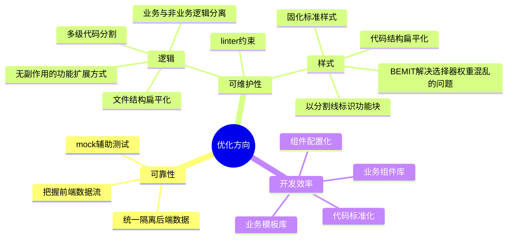
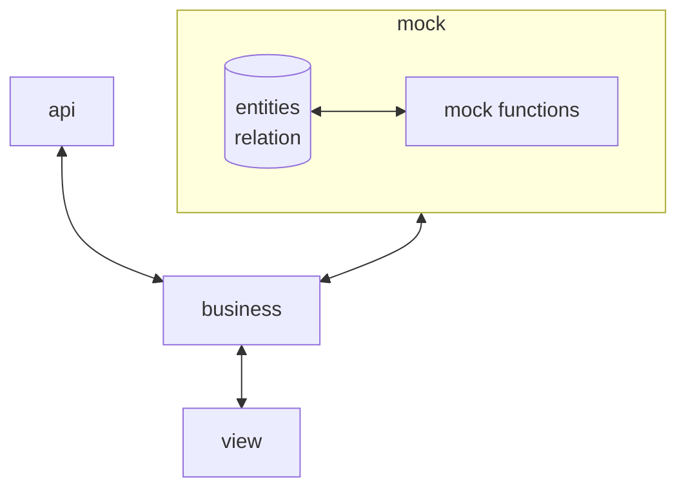

# vue-fusion

前端业务项目开发框架，主要技术栈为vue、vite和typescript。

> 本仓库仅作示例使用，目的是展示在人力资源有限、需求较为简单的情况下个人对前端框架设计的思考。
> 部分细节与资源被移除，部分依赖未打包而是直接展示代码。

## 设计理念

### 总览



### 数据安全

- 前端自己产生的数据应被完全掌控。
- 从后端获取的数据都是不安全的，需统一隔离。
- 后端数据问题导致的错误不可引起页面整体或局部崩溃。

### 渐进式扩展

- 根据实际需求灵活改变项目结构，选用扩展功能。
- 组件内通过hook注入的方式扩展功能。hook之间使用getter和setter进行交互。
- ts代码利用`import 'xxx'`与`import 'xxx/index'`等效的特性变文件为目录进行扩展。

### 数据驱动视图

- 使用配置化、命令式的组件。
- 后续结合AI能力，生成可靠的、可维护的业务代码。

### 标准化

- 统一开发流程，统一代码写法。
- 利于提效，减少人为失误，便于整体修改。

### 简单可靠

- 力求以最小的成本谋取最大的收益。
- 使用最简单的实现方案，降低维护成本与心智负担。

### 防劣化

- linter约束，formatter统一格式化。
- 把握数据流向，把握数据结构，就没有摸不清的流程。
- 只要不冗长，只要层次分明，就没有看不懂的代码。

#### 如何把握数据流

- 把握每个节点的输入输出类型。
- 把握每个节点在成功和失败两种情况下的处理方案。
- 尽量应用显式数据流，应用纯函数。
- 利用函数式库优化代码写法。

以下是利用[fx-flow](https://fx-flow.niuiic.com/)构建数据流的一个案例。`转换参数->调用接口->转换返回值->统一错误信息`。

```typescript
;(args) =>
  flow(
    ok(args),
    into((data) => ({ companyCode: data.company })),
    andThen(queryCompanyStatisticsInfoApi),
    andThen((data) =>
      ok(
        format([
          ['场站', data.stationCount, '个'],
          ['气瓶', data.cylinderCount, '支'],
          ['车辆', data.carCount, '辆'],
          ['从业人员', data.employeeCount, '人'],
          ['用户', data.customerCount, '户']
        ])
      )
    ),
    mapErr(() => '查询企业统计信息失败')
  )
```

#### 如何分割代码

- 必要时抽离函数。
- 必要时拆分文件。
- 注释分割线，配合自定义编辑器插件即可展现文件代码结构。


## css方案

- vue scoped样式隔离。
- BEM命名法。
- 魔改的ITCSS结构。
- 基于css变量的主题切换方案。

## 适配方案

- 类rem方案。根字体大小以vh单位定义，实际值小于12px时固定页面高度，固定根字体大小为12px，横向使用flex、grid或流体布局。

> 适用于大屏应用，即正好占满全屏，整体不可滚动，页面内容饱满。

- 自动替换px。

- 可灵活调整。

## 项目结构

```
src/
  api/
    types/
    impl/
  assets/
  business/
    types/
    impl/
  config/
    enum/
    router.ts
    ...
  mock/
    db/
      entities/
      relation/
    business/
  model/
  view/
    components/
    pages/
  App.vue
  main.ts
```

完整项目分层为model、mock、api、business和view。其中model定义业务模型，mock定义mock函数，api定义接口函数，business定义业务函数，view实现页面逻辑。

该分层方案下，前端将自建一套业务模型，彻底与后端分离。在无接口的情况下也可依靠mock运行完整逻辑。view层与数据的交互全部通过调用business层的接口实现，business层在不同模式下分别调用api层和mock层的接口实现逻辑。business和mock层基于model层定义的业务模型提供接口。



### 为什么自建业务模型

- 应对无接口文档的情况。
- 应对前端进度超越后端的情况。
- 应对后端接口频繁变动的情况。
- 应对后端接口不契合前端逻辑的情况。
- 将绝大部分数据处理放到business层，尽可能让view层拿到的数据直接可用。
- 便于mock在本地模拟数据库，实现完整的交互逻辑。

> 可选，满足开发和测试需求，就不需要实现额外的交互逻辑。

- 切断mock与api的联系，避免因api的变动而改动mock。

> 不符合以上场景时可令view直接对接api，加快开发速度。

### mock的职责

- 无接口时辅助页面开发。
- 前端页面与逻辑测试。

## 类型守护

通过ts类型将同一模块的所有逻辑关联起来，一旦业务模型变动，这些逻辑中需要修改的部分都会报告ts错误。便于修改，防止错漏。

## monorepo

- 便于开发公共组件、函数等。
- 便于统一同系列系统的依赖。
